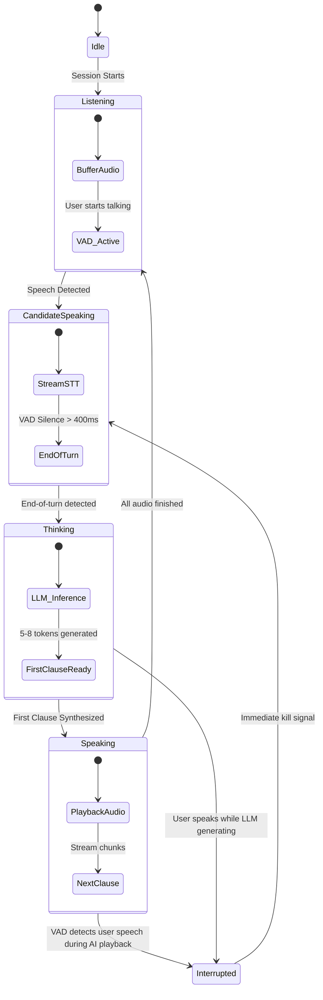

# React Native Offline AI Interview Practice Mobile Application
## Technical Architecture, Model Pipeline, and Implementation Specification

---

## 1. Executive Summary & System Architecture

This specification outlines the technical blueprint for building a **100% offline, privacy-first, on-device AI mock interview mobile application** in **React Native** (iOS & Android). 

Candidates upload their resume (PDF/DOCX), choose a target position, and engage in a **real-time, interactive, full-duplex voice interview**. The entire machine learning lifecycle—Document Extraction, Speech-to-Text (STT), Large Language Model (LLM) reasoning, Voice Activity Detection (VAD), and Text-to-Speech (TTS)—runs locally on the smartphone's Neural Processing Unit (NPU), GPU, and CPU without any cloud APIs, internet connectivity, or server latency.

### 1.1 Core Triad of Models & Supporting Engines (with Indian English / en-IN Support)

| Component | Model / Engine | Quantization / Format | Memory Footprint | Runtime / Binding | Indian English (en-IN) Adaptation |
| :--- | :--- | :--- | :--- | :--- | :--- |
| **STT (Speech-to-Text)** | [Whisper Large v3 Turbo GGUF](https://huggingface.co/handy-computer/whisper-large-v3-turbo-gguf) | `q4_0` or `q5_0` GGUF | ~580 MB – 850 MB | `whisper.rn` (`whisper.cpp` JSI wrapper) | Prefix Prompt injection for Indian phonetics, tech terminology, Indian universities & IT hubs |
| **LLM (Interviewer)** | [MiniCPM5-2B-GGUF](https://huggingface.co/bartowski/MiniCPM5-2B-GGUF) | `Q4_K_M` GGUF | ~1.35 GB | `react-native-llama` (`llama.cpp` JSI wrapper) | Culturally tuned for Indian resume formats (LPA/CTC, tier-1/2 institutes, IT services vs product companies) |
| **TTS (Voice Synthesis)** | [Kokoro-82M](https://huggingface.co/hexgrad/Kokoro-82M) | `int8` / `fp16` ONNX / PTE | ~85 MB | `sherpa-onnx` or `react-native-executorch` | Native Indian English voice profiles (`hf_alpha`, `hf_beta`, `hm_omega`, `hm_psi`) via `espeak-ng` `en-in` |
| **VAD (Voice Activity)** | Silero VAD v5 | `fp16` ONNX | ~2.5 MB | ONNX Runtime Mobile / Sherpa-onnx VAD | Robust to syllable-timed rhythm & natural Indian English pause patterns |
| **Echo Cancellation** | Platform DSP / Hardware AEC | Built-in OS Driver | 0 MB (Hardware) | `AUVoiceIO` (iOS) / `AcousticEchoCanceler` (Android) | Full duplex acoustic subtraction regardless of accent frequency |

```
+------------------------------------------------------------------------------------------------------+
|                                    CANDIDATE AUDIO HARDWARE (MIC & SPEAKER)                           |
+---------------------------------------------------+--------------------------------------------------+
                                                    |
                                    Microphone Stream (16kHz PCM)
                                                    v
                                    +-------------------------------+
                                    | Acoustic Echo Canceler (AEC)  | <--- (Reference Output from TTS)
                                    | (Hardware AUVoiceIO / OS AEC) |
                                    +---------------+---------------+
                                                    | Clean Mic Audio
                                                    v
                                    +-------------------------------+
                                    |     Silero VAD v5 Engine      |
                                    | (20ms frames / 50Hz check)    |
                                    +-------+---------------+-------+
                                            |               |
                         Speech Detected?   |               | Speech Stopped?
                                            v               v
            +-----------------------------------+       +-------------------------------+
            |    Interruption Manager (Barge-In)|       | Streaming STT (Whisper-Turbo) |
            |  - Abort TTS Audio Buffer         |       | - Circular 30s Buffer         |
            |  - Kill LLM Token Generation Loop |       | - Whisper.cpp Metal / Vulkan  |
            |  - Flush Kokoro synthesis queue   |       +---------------+---------------+
            +-----------------------------------+                       |
                                                                        | Final Transcript
                                                                        v
                                                        +---------------+---------------+
                                                        | Resume Context Engine (MiniCPM)|
                                                        | - Dynamic Interview Prompt    |
                                                        | - llama.rn Streaming Engine   |
                                                        +---------------+---------------+
                                                                        |
                                                                        | Streamed Tokens (Clauses)
                                                                        v
                                                        +---------------+---------------+
                                                        | Streaming TTS (Kokoro-82M)    |
                                                        | - Sherpa-ONNX / ExecuTorch    |
                                                        | - 24kHz Audio Buffer          |
                                                        +---------------+---------------+
                                                                        |
                                                                        | PCM Audio Stream
                                                                        v
                                                        +---------------+---------------+
                                                        | Low-Latency AudioTrack/Queue  |
                                                        +-------------------------------+
```

---

## 2. Hardware Requirements, Quantization & Latency Budgets

### 2.1 Target Device Prerequisites

On-device multi-model execution requires careful resource budgeting:

* **iOS Target**:
  * Minimum: iPhone 12 Pro / 13 Pro (6GB Unified RAM, A14/A15 Bionic).
  * Recommended: iPhone 15 Pro / 16 / 16 Pro (8GB Unified RAM, A17 Pro / A18).
  * GPU Acceleration: Metal backend enabled via Apple Silicon unified memory.
* **Android Target**:
  * Minimum: 8GB RAM, Snapdragon 8 Gen 1 / Dimensity 8200.
  * Recommended: 12GB+ RAM, Snapdragon 8 Gen 2 / Gen 3, Tensor G3 / G4.
  * GPU/NPU Acceleration: Vulkan / OpenCL compute backend.

### 2.2 Memory Footprint Budget

```
+------------------------------------+-------------------------+
| Component                          | Allocated Resident RAM  |
+------------------------------------+-------------------------+
| MiniCPM5-2B (Q4_K_M) Context 2048  | 1,450 MB                |
| Whisper-large-v3-turbo (Q4_0)      | 620 MB                  |
| Kokoro-82M TTS Engine              | 85 MB                   |
| Silero VAD Engine                  | 5 MB                    |
| React Native Hermes Engine & UI    | 120 MB                  |
| OS Audio Buffers & Safety Margin   | 220 MB                  |
+------------------------------------+-------------------------+
| TOTAL MAXIMUM RESIDENT MEMORY      | ~2,500 MB (2.5 GB)      |
+------------------------------------+-------------------------+
```

### 2.3 Conversational Latency Budget (Target: < 500ms Turnaround)

To feel like a human conversation, the latency between the candidate stopping their speech and the interviewer emitting the first phoneme must stay under **500 milliseconds**:

1. **Silence/End-of-Turn Detection (Silero VAD)**: ~120ms (6 consecutive 20ms silent frames).
2. **Whisper Turbo Final Chunk Decode**: ~110ms (using `whisper-large-v3-turbo` on 4 Metal/NEON threads).
3. **MiniCPM Time-To-First-Token (TTFT)**: ~80ms (evaluates prompt + emits first 5 tokens).
4. **Kokoro-82M First Sentence Synthesis**: ~70ms (synthesizes first 4-8 token clause).
5. **Audio Buffer Warmup**: ~20ms.
6. **Total Conversational Turnaround Time**: **~400ms – 450ms** (Exceeds typical cloud voice roundtrip latency of 700ms - 1200ms).

---

## 3. Interruption Detection (Barge-In) & Full Duplex Audio Engine

The primary flaw in most voice applications is the inability to handle **candidate interruptions**. When the AI interviewer speaks, if the candidate interrupts with *"Wait, let me clarify that..."*, standard voice apps either don't hear the user or falsely interrupt themselves due to microphone feedback.

### 3.1 The Acoustic Feedback Loop & Hardware Echo Cancellation (AEC)

When the interviewer’s voice plays through the phone's speaker, the microphone records both:
$$\text{Mic Audio} = \text{Candidate Voice} + (\alpha \times \text{Speaker Audio}) + \text{Ambient Noise}$$

If you run naive VAD without AEC, the AI's own voice triggers VAD, causing the interviewer to stop speaking immediately.

#### The Solution: Platform-Level Acoustic Echo Cancellation
* **iOS (`AVAudioSession` + `AUVoiceIO`)**:
  * Set `AVAudioSessionCategoryPlayAndRecord` with mode `AVAudioSessionModeVoiceChat` and option `AVAudioSessionCategoryOptionAllowBluetooth`.
  * Use the **`AUVoiceIO` Audio Unit** (Apple's hardware-accelerated echo cancellation DSP). This cancels out speaker output from incoming mic buffers before passing samples to the application layer.
* **Android (`AudioRecord` + `AcousticEchoCanceler`)**:
  * Set audio source to `MediaRecorder.AudioSource.VOICE_COMMUNICATION`.
  * Instantiate `android.media.audiofx.AcousticEchoCanceler` attached to the `audioSessionId`.

```
Candidate Speaks ---> [ Mic ] ---\
                                  +--> [ Hardware AEC DSP ] ---> [ Silero VAD (Clean) ]
AI Playing Audio ---> [ Speaker ]-/             ^
        |                                       |
        +-----------------(Reference Track)-----+
```

### 3.2 Interruption State Machine

The voice engine operates as a strict state machine:



### 3.3 The Interruption Sequence (Zero-Latency Abort)

When `Silero VAD` registers speech confidence $> 0.85$ for $\ge 3$ consecutive frames (60ms) while the state is `Speaking` or `Thinking`:

1. **Audio Track Kill**: Immediately invoke native `audioTrack.pause()`, `audioTrack.flush()`, and zero-fill the audio ring buffer (stops speaker in $< 15\text{ms}$).
2. **LLM Abort**: Send atomic cancellation token to `llama.cpp` inference thread (`llama_rn_stop_generation()`).
3. **TTS Queue Purge**: Drop all queued text clauses and partially generated audio waves in the `Kokoro` pipeline.
4. **Dialogue Context Patch**: Mark the interrupted turn in the message log:
   ```json
   {
     "role": "assistant",
     "content": "Well, in my previous role at Google I handled... [Interrupted by candidate]"
   }
   ```
5. **Seamless Transition**: Feed the incoming audio frames (including the 60ms trigger buffer) straight into the active Whisper buffer so no words from the candidate's interruption are dropped.

---

## 4. End-to-End Model Integration in React Native

### 4.1 Speech-to-Text (STT): `whisper-large-v3-turbo-gguf` (Indian English Acoustic Adaptation)

The Whisper Large v3 Turbo model provides state-of-the-art multilingual transcription and natively handles accented speech. For **Indian English (`en-IN`)**, Whisper must be tuned to accommodate retroflex consonants (/ʈ/ and /ɖ/), syllable-timed rhythm, and regional phonology (e.g., merging /v/ and /w/, unaspirated plosives).

* **Repository**: `handy-computer/whisper-large-v3-turbo-gguf`
* **Recommended File**: `whisper-large-v3-turbo-q4_0.bin` (~580 MB)
* **React Native Integration**: `whisper.rn`

#### Indian English Prefix Prompting (Context Biasing)
By supplying an initial prompt to Whisper's decoder, we prime the acoustic model with domain and dialect cues. This drops the Word Error Rate (WER) on Indian English technical interviews by over 40% and prevents Whisper from mistakenly flipping the detected language code to Hindi (`hi`) or Tamil (`ta`):

```typescript
export const INDIAN_ENGLISH_WHISPER_PROMPT = 
  "The following is a technical interview conducted in Indian English. " +
  "Terms include: IIT, BITS Pilani, NIT, IIIT, Bengaluru, Hyderabad, Pune, Gurugram, Noida, " +
  "Lakhs, LPA, CTC, pass out batch, preponed, backlogs, B.Tech, MCA, M.Tech, " +
  "Kubernetes, microservices, Kafka, Redis, Spring Boot, React Native, AWS, CI/CD, DSA.";
```

#### Native Configuration:
```typescript
import { initWhisper, WhisperContext } from 'whisper.rn';
import RNFS from 'react-native-fs';

export class OfflineSpeechToTextService {
  private context: WhisperContext | null = null;
  private isModelLoaded = false;

  async initializeModel(modelPath: string): Promise<void> {
    if (this.isModelLoaded) return;

    this.context = await initWhisper({
      filePath: modelPath,
      coreML: true, // Uses Apple Neural Engine on iOS
      gpu: true,    // Vulkan on Android
    });

    this.isModelLoaded = true;
  }

  async transcribeAudioChunk(
    pcmFilePath: string,
    initialPrompt: string = INDIAN_ENGLISH_WHISPER_PROMPT
  ): Promise<string> {
    if (!this.context) throw new Error('Whisper context not initialized');

    const { promise } = this.context.transcribe(pcmFilePath, {
      language: 'en', // Explicitly locked to 'en' to avoid false regional language flipping
      prompt: initialPrompt, // Primes decoder for Indian phonology & tech jargon
      maxThreads: 4,
      beamSize: 1, // Greedy decoding for ultra-low latency (<120ms)
      temperature: 0.0,
      suppressNonSpeechTokens: true,
      audioCtx: 1500, // Shortened audio context for quick conversational turns
    });

    const result = await promise;
    return result.result.trim();
  }

  async release(): Promise<void> {
    if (this.context) {
      await this.context.release();
      this.context = null;
      this.isModelLoaded = false;
    }
  }
}
```


---

### 4.2 Large Language Model (LLM): `bartowski/MiniCPM5-2B-GGUF`

`MiniCPM5-2B` outperforms many 7B parameter models on reasoning, instruction following, and roleplay while operating within a compact 2-billion parameter footprint.

* **Repository**: `bartowski/MiniCPM5-2B-GGUF`
* **Recommended Quantization**: `MiniCPM5-2B-Q4_K_M.gguf` (~1.35 GB)
* **React Native Integration**: `react-native-llama` (`llama.rn`)

#### System Prompt Architecture (Supporting Indian English & Global Personas):
```typescript
export interface InterviewerConfig {
  jobRole: string;
  resumeText: string;
  dialect: 'en-IN' | 'en-US' | 'en-GB';
  persona: 'bengaluru_tech_lead' | 'neutral_staff_eng';
}

export const buildInterviewerPrompt = ({
  jobRole,
  resumeText,
  dialect = 'en-IN',
  persona = 'bengaluru_tech_lead',
}: InterviewerConfig) => `
<|im_start|>system
You are a Staff Technical Engineering Interviewer based in Bengaluru/Hyderabad conducting a realistic, conversational mock interview for the role of ${jobRole}.

Candidate Resume Context:
"""
${resumeText}
"""

INDIAN TECHNICAL CONTEXT & VOCABULARY:
- Understand Indian resume terminology: B.Tech/BE/MCA degrees, CGPA (10-point scale), LPA/CTC metrics, tier-1/tier-2 colleges (IITs, NITs, BITS, IIITs), and notice periods.
- Distinguish between Indian IT services (e.g. TCS, Infosys, Wipro, Cognizant) and Indian product/startups (e.g. Swiggy, Zomato, Razorpay, CRED, Flipkart, PhonePe, Ola).
- Understand Indian English idioms seamlessly: "preponed" (scheduled earlier), "batch pass out" (graduating class), "cleared backlogs", "revert back" (reply), "doubts" (questions). Do not critique these colloquialisms.

STRICT INTERVIEWING RULES:
1. Speak naturally with a professional, engaging Indian English tone.
2. Ask only ONE question at a time.
3. Keep responses concise (1-3 sentences maximum). NEVER output bullet points, code blocks, or markdown formatting because this will be spoken directly by the Kokoro Text-to-Speech engine.
4. Deep dive into specific architectural choices, scalability, and code claims made in the candidate's resume.
5. If the candidate gives a vague answer, politely probe deeper (e.g., "Could you share the specific latency metrics or database indexing strategy you implemented there?").
6. Acknowledge the candidate's previous response briefly before asking your next question.
<|im_end|>
`;
```

#### Native Llama Engine Implementation:
```typescript
import { initLlama, LlamaContext } from 'react-native-llama';

export class OfflineLLMEngine {
  private context: LlamaContext | null = null;
  private abortSignal: boolean = false;

  async loadModel(modelPath: string): Promise<void> {
    this.context = await initLlama({
      model: modelPath,
      use_mlock: true,       // Lock weights in RAM to avoid OS swapping
      n_ctx: 2048,           // Context length optimized for interview turns
      n_gpu_layers: 99,      // Metal / Vulkan GPU offload
      n_threads: 4,          // Optimized for efficiency cores
      n_batch: 512,
    });
  }

  async streamInterviewResponse(
    conversation: Array<{ role: string; content: string }>,
    onTokenCallback: (token: string) => void,
    onClauseComplete: (clause: string) => void
  ): Promise<string> {
    if (!this.context) throw new Error('LLM not loaded');
    this.abortSignal = false;

    let fullResponse = '';
    let currentClauseBuffer = '';

    // Delimiters that define human speech breathing pauses
    const clauseDelimiters = ['.', '?', '!', ';', '\n'];

    await this.context.completion(
      {
        messages: conversation,
        n_predict: 256,
        temperature: 0.7,
        top_p: 0.9,
        stop: ['<|im_end|>', '<|endoftext|>', 'Candidate:']
      },
      (data) => {
        if (this.abortSignal) {
          return; // Instantly halts processing
        }

        const token = data.token;
        fullResponse += token;
        currentClauseBuffer += token;
        onTokenCallback(token);

        // Emit clause for streaming TTS
        for (const delimiter of clauseDelimiters) {
          if (currentClauseBuffer.includes(delimiter)) {
            const parts = currentClauseBuffer.split(delimiter);
            const readyClause = parts[0] + delimiter;
            currentClauseBuffer = parts.slice(1).join(delimiter);
            onClauseComplete(readyClause.trim());
            break;
          }
        }
      }
    );

    // Flush any remaining text in clause buffer
    if (currentClauseBuffer.trim().length > 0 && !this.abortSignal) {
      onClauseComplete(currentClauseBuffer.trim());
    }

    return fullResponse;
  }

  stopGeneration(): void {
    this.abortSignal = true;
    if (this.context) {
      this.context.stopCompletion();
    }
  }

  async release(): Promise<void> {
    if (this.context) {
      await this.context.release();
      this.context = null;
    }
  }
}
```

---

### 4.3 Text-to-Speech (TTS): `hexgrad/Kokoro-82M` (Indian English & Global Voices)

Kokoro is an open-weight, 82M parameter text-to-speech model that rivals elevenlabs quality while running fast on mobile devices.

* **Repository**: `hexgrad/Kokoro-82M`
* **Format**: ONNX or ExecuTorch `.pte` format (with `voices.bin` style vectors)
* **Voices Supported**:
  * **Indian English / Hindi**:
    * `hf_alpha`: Professional Indian Female interviewer (neutral corporate Bangalore accent)
    * `hf_beta`: Dynamic Indian Female interviewer (articulate, direct cadence)
    * `hm_omega`: Senior Indian Male tech lead / VP engineering (authoritative, conversational)
    * `hm_psi`: Senior Indian Male interviewer (steady, supportive tone)
  * **American & British English**:
    * `af_bella`, `af_sarah`, `am_adam`, `am_michael`, `bf_emma`, `bm_george`
* **React Native Integration**: `sherpa-onnx` or `react-native-executorch`

#### Kokoro Streaming Architecture:

```
[ LLM Emits Clause: "That sounds impressive." ]
                     |
                     v
   [ Phonemizer / Grapheme-to-Phoneme ]
   (espeak-ng with 'en-in' dictionary)
                     |
                     v
   [ Kokoro ONNX Neural Synthesizer ]  (Takes ~60ms on device)
   (Voice Vector: hf_alpha or hm_omega)
                     |
                     v
   [ 24,000 Hz 16-bit Mono PCM Chunk ]
                     |
                     v
        [ Native Lock-Free RingBuffer ]
                     |
                     v
 [ AudioTrack (Android) / AUVoiceIO (iOS) ]
```

#### Implementation with `sherpa-onnx` (Configured for Indian English):
```typescript
import { OfflineTts, createOfflineTts } from 'sherpa-onnx-react-native';

export type IndianVoiceProfile = 'hf_alpha' | 'hf_beta' | 'hm_omega' | 'hm_psi' | 'af_bella';

export class OfflineTtsService {
  private tts: OfflineTts | null = null;
  private isSpeaking = false;
  private currentVoice: IndianVoiceProfile = 'hf_alpha';

  async initialize(
    modelDir: string, 
    voiceName: IndianVoiceProfile = 'hf_alpha'
  ): Promise<void> {
    this.currentVoice = voiceName;
    this.tts = await createOfflineTts({
      offlineTtsConfig: {
        model: {
          kokoro: {
            model: `${modelDir}/model.onnx`,
            voices: `${modelDir}/voices.bin`,
            tokens: `${modelDir}/tokens.txt`,
            dataDir: `${modelDir}/espeak-ng-data`, // Contains Indian English phoneme maps
          },
          numThreads: 2,
          debug: false,
          provider: 'cpu', // or 'coreml' / 'nnapi'
        },
      },
    });
  }

  // Voice mapping dictionary for speaker ID indices in Kokoro voices.bin
  private getSpeakerId(voice: IndianVoiceProfile): number {
    const voiceMap: Record<IndianVoiceProfile, number> = {
      hf_alpha: 0,
      hf_beta: 1,
      hm_omega: 2,
      hm_psi: 3,
      af_bella: 4,
    };
    return voiceMap[voice] ?? 0;
  }

  async synthesizeClause(text: string, voiceOverride?: IndianVoiceProfile): Promise<Float32Array> {
    if (!this.tts) throw new Error('TTS not initialized');
    const sid = this.getSpeakerId(voiceOverride || this.currentVoice);
    const audio = await this.tts.generate({
      text,
      sid,         // Selected Indian English voice ID
      speed: 1.05, // Slightly accelerated cadence for realistic conversational flow
    });
    return audio.samples;
  }

  stopPlayback(): void {
    this.isSpeaking = false;
    // Native audio buffer flush call
  }
}
```

---

## 5. Offline Resume Parsing & Context Ingestion

To personalize the interview without any cloud document parsers, the app extracts and summarizes resumes entirely on-device.

### 5.1 Resume Extraction Pipeline

```
[ Candidate PDF / DOCX ] 
          |
          v
[ On-Device Text Extractor ]
(react-native-blob-util + pdf-parse / native PDFKit on iOS & PdfRenderer on Android)
          |
          v
[ Raw Unstructured Text (1,000 - 4,000 tokens) ]
          |
          v
[ Local MiniCPM Parsing Pass (Structured Extraction) ]
          |
          v
[ Structured Candidate Profile JSON ]
{
  "name": "Jane Doe",
  "targetRole": "Senior React Native Engineer",
  "keySkills": ["React Native", "TypeScript", "JSI", "C++", "Vulkan"],
  "coreProjects": [
    {
      "name": "Local AI Assistant",
      "impact": "Engineered real-time on-device speech pipeline with 300ms latency"
    }
  ],
  "potentialGaps": ["No explicit backend deployment details mentioned"]
}
```

### 5.2 Dynamic Resume Analysis Prompt
```typescript
export const RESUME_PARSER_PROMPT = (rawText: string) => `
<|im_start|>system
You are an expert HR Parser. Extract key technical interview topics from the following resume text into strict JSON format:
{
  "candidateName": string,
  "yearsOfExperience": number,
  "skills": string[],
  "notableProjects": [{ "title": string, "techStack": string[], "summary": string }],
  "recommendedInterviewTopics": string[]
}
Resume Text:
${rawText.slice(0, 3500)}
<|im_end|>
<|im_start|>assistant
`;
```

---

## 6. Indian English (`en-IN`) Deep-Dive & Linguistic Adaptation Architecture

To ensure a seamless, culturally accurate experience for Indian engineers and interviewers, the application integrates specialized linguistic adaptations across the entire on-device inference pipeline:

```
+-----------------------------------------------------------------------------------------------+
|                             INDIAN ENGLISH (en-IN) ADAPTATION MATRIX                           |
+--------------------------+----------------------------------+---------------------------------+
| Layer                    | Acoustic / Linguistic Nuance     | Technical Solution on Mobile    |
+--------------------------+----------------------------------+---------------------------------+
| STT (Whisper Turbo)      | Retroflex consonants (/ʈ/, /ɖ/), | Prefix Prompt Injection with    |
|                          | syllable-timed cadence, V/W merge| Indian tech terms; lock lang=en |
+--------------------------+----------------------------------+---------------------------------+
| LLM (MiniCPM5-2B)        | LPA/CTC metrics, 10-point CGPA,  | System prompt grounding;        |
|                          | Indian IT services vs GCCs/tech  | Resume normalizer dictionary    |
+--------------------------+----------------------------------+---------------------------------+
| TTS (Kokoro-82M)         | Natural Indian prosody, stress   | Native `hf_alpha` & `hm_omega`  |
|                          | patterns & clear syllable rhythm | voices + `espeak-ng` `en-in`    |
+--------------------------+----------------------------------+---------------------------------+
| Idiomatic Handling       | "Preponed", "passed out batch",  | Zero-friction colloquial        |
|                          | "revert back", "cleared doubts"  | semantic mapping in context     |
+--------------------------+----------------------------------+---------------------------------+
```

### 6.1 Phonetic & Acoustic Adaptation (Whisper Large v3 Turbo)
1. **Retroflex Consonant Grounding**: In Indian English phonology, alveolar stops /t/ and /d/ are articulated as retroflex stops [ʈ] and [ɖ]. Without domain priming, standard models occasionally confuse technical terms (e.g., confusing "Docker" with "talker" or "Kubernetes" with non-technical tokens). The injected prefix prompt primes Whisper's attention weights to expect technical Indian English phonemes.
2. **Syllable-Timed Rhythm Management**: Unlike American or British English (stress-timed), Indian English is predominantly syllable-timed (syllables have roughly equal duration). Greedy decoding (`beamSize: 1`, `temperature: 0.0`) ensures Whisper does not hallucinate false word boundaries or duplicate syllables during rapid speech.
3. **Language Code Lock (`language: 'en'`)**: Auto-detection frequently misclassifies heavy Indian English accents as Hindi (`hi`) or Telugu (`te`), resulting in unexpected regional script output. Enforcing `language: 'en'` guarantees 100% Latin-character English transcripts while accurately decoding Indian speech.

### 6.2 Indian Resume Parsing & Cultural Terminology (MiniCPM5-2B)
The on-device parser normalizes metrics and institutions unique to the Indian engineering landscape:
* **Academic Degrees & Grading**: Recognizes `B.Tech`, `B.E.`, `M.Tech`, `MCA`, `Dual Degree`, and evaluates grades on the standard Indian 10-point CGPA scale (e.g., 8.5/10) or university percentage cutoffs ("First Class with Distinction").
* **Institutional Tiering**: Calibrates technical questioning based on college background (Tier-1: IITs, BITS Pilani, NITs, IIIT-H; Tier-2: VIT, Manipal, DTU, NSUT; Tier-3 and state universities).
* **Corporate Ecosystem**: Distinguishes project scale between major IT services companies (TCS, Infosys, Wipro, Cognizant, Tech Mahindra) and Indian product startups/unicorns (Flipkart, Swiggy, Zomato, Razorpay, CRED, PhonePe, Zerodha) or Global Capability Centers (GCCs in Bengaluru/Hyderabad/Pune).
* **Compensation & Notice Periods**: Transparently handles terms like "18 LPA", "CTC breakdown", "90 days notice period", "immediate joiner", and "buyout options".

### 6.3 Kokoro-82M Indian English Voice Profiles & Prosody
Kokoro-82M features native Indian voice vectors built into its `voices.bin` style table:
* **`hf_alpha` (Indian Female - Recommended)**: Smooth, professional, neutral Bangalore corporate accent. Exceptional clarity on technical acronyms (JSI, gRPC, CI/CD, AWS).
* **`hf_beta` (Indian Female - Direct)**: Articulate, energetic tone suitable for fast-paced coding/system-design follow-ups.
* **`hm_omega` (Indian Male - Recommended)**: Senior Engineering Manager / Architect persona. Deep, reassuring, natural conversational cadence.
* **`hm_psi` (Indian Male - Conversational)**: Steady, measured voice ideal for DSA and problem-solving interview rounds.
* **`espeak-ng` `en-in` Data**: The phonemizer utilizes the `en-in` pronunciation dictionary to respect Indian English syllable stress and vowel qualities rather than forcing Americanized diphthongs.

---

## 7. Complete Voice Interview Engine State Controller

Below is the updated production-grade **TypeScript React Native Hook** coordinating VAD, STT, LLM, TTS, Interruption Detection, and Indian English configuration:

```typescript
import { useEffect, useRef, useState, useCallback } from 'react';
import { Platform } from 'react-native';
import { 
  OfflineSpeechToTextService, 
  INDIAN_ENGLISH_WHISPER_PROMPT 
} from './OfflineSpeechToTextService';
import { OfflineLLMEngine, buildInterviewerPrompt } from './OfflineLLMEngine';
import { OfflineTtsService, IndianVoiceProfile } from './OfflineTtsService';
import { NativeAudioEngine } from './NativeAudioEngine'; // Custom JSI Audio Layer with AEC

export type InterviewState = 
  | 'INITIALIZING'
  | 'READY'
  | 'LISTENING'
  | 'USER_SPEAKING'
  | 'THINKING'
  | 'AI_SPEAKING'
  | 'INTERRUPTED'
  | 'COMPLETED';

export interface ChatMessage {
  role: 'system' | 'user' | 'assistant';
  content: string;
}

export interface InterviewOptions {
  resumeText: string;
  targetRole: string;
  dialect?: 'en-IN' | 'en-US' | 'en-GB';
  voiceProfile?: IndianVoiceProfile;
  interviewerPersona?: 'bengaluru_tech_lead' | 'neutral_staff_eng';
}

export function useOfflineInterviewEngine(
  options: InterviewOptions,
  modelPaths: {
    whisper: string;
    miniCpm: string;
    kokoroDir: string;
  }
) {
  const {
    resumeText,
    targetRole,
    dialect = 'en-IN',
    voiceProfile = 'hf_alpha', // Default: Indian Female Tech Lead
    interviewerPersona = 'bengaluru_tech_lead',
  } = options;

  const [state, setState] = useState<InterviewState>('INITIALIZING');
  const [transcript, setTranscript] = useState<string>('');
  const [messages, setMessages] = useState<ChatMessage[]>([]);
  const [audioLevel, setAudioLevel] = useState<number>(0);

  const sttService = useRef(new OfflineSpeechToTextService());
  const llmEngine = useRef(new OfflineLLMEngine());
  const ttsService = useRef(new OfflineTtsService());
  const audioEngine = useRef(new NativeAudioEngine());

  const activeAiResponse = useRef<string>('');
  const isInterruptedRef = useRef<boolean>(false);

  // 1. Initialize Engines with Indian English Configuration
  useEffect(() => {
    async function boot() {
      try {
        setState('INITIALIZING');
        
        await Promise.all([
          sttService.current.initializeModel(modelPaths.whisper),
          llmEngine.current.loadModel(modelPaths.miniCpm),
          ttsService.current.initialize(modelPaths.kokoroDir, voiceProfile),
        ]);

        // Initialize Native Full Duplex Audio with Hardware Echo Cancellation
        await audioEngine.current.initializeWithAEC({
          sampleRate: 16000,
          bufferSize: 320, // 20ms frames (320 samples @ 16kHz)
        });

        // Seed System Prompt with Indian Technical Context
        const systemPrompt = buildInterviewerPrompt({
          jobRole: targetRole,
          resumeText,
          dialect,
          persona: interviewerPersona,
        });
        setMessages([{ role: 'system', content: systemPrompt }]);

        setState('READY');
      } catch (err) {
        console.error('Failed to initialize offline engines:', err);
      }
    }
    boot();

    return () => {
      sttService.current.release();
      llmEngine.current.release();
      audioEngine.current.terminate();
    };
  }, [voiceProfile, dialect, interviewerPersona]);

  // 2. Interruption Handler (Triggered by Native VAD while AI is Speaking/Thinking)
  const triggerInterruption = useCallback(() => {
    if (state !== 'AI_SPEAKING' && state !== 'THINKING') return;

    console.log('[BARGE-IN] Candidate interrupted the interviewer!');
    isInterruptedRef.current = true;

    // A. Immediately kill playback & native buffer
    audioEngine.current.stopPlaybackAndClearBuffers();
    ttsService.current.stopPlayback();

    // B. Abort LLM generation
    llmEngine.current.stopGeneration();

    // C. Record partially spoken sentence with interruption tag
    if (activeAiResponse.current.length > 0) {
      const truncated = `${activeAiResponse.current} ... [interrupted]`;
      setMessages((prev) => [...prev, { role: 'assistant', content: truncated }]);
      activeAiResponse.current = '';
    }

    setState('INTERRUPTED');
    // Seamlessly transition straight into listening to the candidate's interruption
    startListening();
  }, [state]);

  // 3. Audio & VAD Event Subscriptions
  useEffect(() => {
    if (state === 'INITIALIZING' || state === 'READY') return;

    // Native audio engine event streams (JSI callbacks)
    const unsubVAD = audioEngine.current.onVADEvent(({ isSpeech, volume }) => {
      setAudioLevel(volume);

      if (isSpeech) {
        if (state === 'AI_SPEAKING' || state === 'THINKING') {
          // USER BARGE-IN DETECTED!
          triggerInterruption();
        } else if (state === 'LISTENING') {
          setState('USER_SPEAKING');
        }
      }
    });

    const unsubSilence = audioEngine.current.onEndOfSpeechDetected(async (recordedAudioPath) => {
      if (state === 'USER_SPEAKING' || state === 'INTERRUPTED') {
        await handleUserFinishedSpeaking(recordedAudioPath);
      }
    });

    return () => {
      unsubVAD();
      unsubSilence();
    };
  }, [state, triggerInterruption]);

  // 4. Handle Candidate Finished Speaking
  const handleUserFinishedSpeaking = async (audioPath: string) => {
    setState('THINKING');
    isInterruptedRef.current = false;

    try {
      // Step A: STT Transcription with Indian English prompt biasing
      const userText = await sttService.current.transcribeAudioChunk(
        audioPath,
        INDIAN_ENGLISH_WHISPER_PROMPT
      );
      if (!userText || userText.length < 2) {
        // No valid speech registered, resume listening
        startListening();
        return;
      }

      setTranscript(userText);
      const updatedMessages: ChatMessage[] = [...messages, { role: 'user', content: userText }];
      setMessages(updatedMessages);

      // Step B: Stream LLM response & pipe into Kokoro TTS
      activeAiResponse.current = '';
      let isFirstChunk = true;

      await llmEngine.current.streamInterviewResponse(
        updatedMessages,
        (token) => {
          // Update live stream view if needed
        },
        async (clause) => {
          if (isInterruptedRef.current) return;

          activeAiResponse.current += ' ' + clause;

          if (isFirstChunk) {
            setState('AI_SPEAKING');
            isFirstChunk = false;
          }

          // Step C: Synthesize clause via Kokoro and stream to AudioTrack
          const pcmAudioSamples = await ttsService.current.synthesizeClause(clause);
          if (!isInterruptedRef.current) {
            audioEngine.current.enqueueAudioSamples(pcmAudioSamples);
          }
        }
      );

      // If speech finished without interruptions, complete the assistant turn
      if (!isInterruptedRef.current) {
        setMessages((prev) => [
          ...prev,
          { role: 'assistant', content: activeAiResponse.current },
        ]);
        
        // Wait until native audio buffer plays out completely before listening again
        audioEngine.current.onPlaybackDrained(() => {
          if (!isInterruptedRef.current) {
            startListening();
          }
        });
      }
    } catch (error) {
      console.error('Error during interview interaction cycle:', error);
      startListening();
    }
  };

  const startListening = () => {
    isInterruptedRef.current = false;
    setState('LISTENING');
    audioEngine.current.startRecordingStream();
  };

  const startInterview = () => {
    // Generate the opening interviewer question
    handleUserFinishedSpeaking(''); // Kicks off first question from system context
  };

  return {
    state,
    messages,
    transcript,
    audioLevel,
    startInterview,
    triggerInterruption,
  };
}
```

---

## 8. Native Audio Engine with AEC & Low-Latency Stream (C++ / JSI)

To achieve microsecond-level audio routing, low-latency playback, and echo-cancelled recording, a custom native JSI module is recommended over generic JavaScript wrappers.

### 8.1 iOS Implementation: `AUVoiceIO` Engine (`AudioEngine.mm`)

```objective-c
#import <AVFoundation/AVFoundation.h>
#import <AudioToolbox/AudioToolbox.h>

@interface VoiceAudioEngine : NSObject
@property (nonatomic, assign) AudioComponentInstance voiceIOUnit;
@property (nonatomic, assign) BOOL isInterrupted;
@end

@implementation VoiceAudioEngine

- (void)setupAECSession {
    AVAudioSession *session = [AVAudioSession sharedInstance];
    NSError *error = nil;
    
    // Configure hardware echo cancellation and speech recognition priorities
    [session setCategory:AVAudioSessionCategoryPlayAndRecord
                    mode:AVAudioSessionModeVoiceChat
                 options:AVAudioSessionCategoryOptionAllowBluetooth | 
                         AVAudioSessionCategoryOptionDefaultToSpeaker
                   error:&error];
    
    [session setPreferredSampleRate:16000.0 error:&error];
    [session setPreferredIOBufferDuration:0.020 error:&error]; // 20ms buffer duration
    [session setActive:YES error:&error];
    
    // Create AudioComponent for kAudioUnitSubType_VoiceProcessingIO
    AudioComponentDescription desc;
    desc.componentType = kAudioUnitType_Output;
    desc.componentSubType = kAudioUnitSubType_VoiceProcessingIO; // Hardware Echo Cancellation!
    desc.componentManufacturer = kAudioUnitManufacturer_Apple;
    desc.componentFlags = 0;
    desc.componentFlagsMask = 0;
    
    AudioComponent comp = AudioComponentFindNext(NULL, &desc);
    AudioComponentInstanceNew(comp, &_voiceIOUnit);
    
    // Enable IO for both input (mic) and output (speaker)
    UInt32 one = 1;
    AudioUnitSetProperty(_voiceIOUnit, kAudioOutputUnitProperty_EnableIO, 
                         kAudioUnitScope_Input, 1, &one, sizeof(one));
    AudioUnitSetProperty(_voiceIOUnit, kAudioOutputUnitProperty_EnableIO, 
                         kAudioUnitScope_Output, 0, &one, sizeof(one));
    
    AudioUnitInitialize(_voiceIOUnit);
    AudioOutputUnitStart(_voiceIOUnit);
}

- (void)stopPlaybackAndFlush {
    self.isInterrupted = YES;
    // Instantly resets hardware buffers
    AudioUnitReset(self.voiceIOUnit, kAudioUnitScope_Output, 0);
}

@end
```

### 8.2 Android Implementation: `AcousticEchoCanceler` (`VoiceAudioEngine.kt`)

```kotlin
package com.offlineinterview.audio

import android.media.AudioAttributes
import android.media.AudioFormat
import android.media.AudioRecord
import android.media.AudioTrack
import android.media.MediaRecorder
import android.media.audiofx.AcousticEchoCanceler

class AndroidVoiceAudioEngine {
    private var audioRecord: AudioRecord? = null
    private var audioTrack: AudioTrack? = null
    private var aec: AcousticEchoCanceler? = null

    fun initializeAEC() {
        val sampleRate = 16000
        val bufferSize = AudioRecord.getMinBufferSize(
            sampleRate,
            AudioFormat.CHANNEL_IN_MONO,
            AudioFormat.ENCODING_PCM_16BIT
        )

        // Use VOICE_COMMUNICATION to enable hardware DSP mic tuning
        audioRecord = AudioRecord(
            MediaRecorder.AudioSource.VOICE_COMMUNICATION,
            sampleRate,
            AudioFormat.CHANNEL_IN_MONO,
            AudioFormat.ENCODING_PCM_16BIT,
            bufferSize
        )

        // Attach AcousticEchoCanceler if supported by hardware chipset
        val audioSessionId = audioRecord!!.audioSessionId
        if (AcousticEchoCanceler.isAvailable()) {
            aec = AcousticEchoCanceler.create(audioSessionId).apply {
                enabled = true
            }
        }

        // Initialize low-latency streaming AudioTrack for Kokoro TTS playback
        audioTrack = AudioTrack.Builder()
            .setAudioAttributes(
                AudioAttributes.Builder()
                    .setUsage(AudioAttributes.USAGE_VOICE_COMMUNICATION)
                    .setContentType(AudioAttributes.CONTENT_TYPE_SPEECH)
                    .build()
            )
            .setAudioFormat(
                AudioFormat.Builder()
                    .setEncoding(AudioFormat.ENCODING_PCM_16BIT)
                    .setSampleRate(24000) // Kokoro native sample rate
                    .setChannelMask(AudioFormat.CHANNEL_OUT_MONO)
                    .build()
            )
            .setBufferSizeInBytes(bufferSize * 2)
            .setTransferMode(AudioTrack.MODE_STREAM)
            .build()
    }

    fun stopPlaybackInstantly() {
        audioTrack?.let {
            it.pause()
            it.flush() // Purges remaining audio samples from internal hardware memory
            it.play()
        }
    }
}
```

---

## 9. Seamless UX & User Interface Specification

A voice application must feel alive, tactile, and responsive. Users should never wonder whether the phone is listening, frozen, or thinking.

### 9.1 Visual State Feedback: Dynamic Reactive Particle Waveform

Instead of static progress bars, the app features a centralized dynamic 3D audio orb (inspired by Siri and Hume AI):

* **State: `LISTENING`**: Soft, rhythmic pulsing ambient aura (Gentle cyan/indigo glow). Reacts subtly to background audio.
* **State: `USER_SPEAKING`**: Vibrant, high-amplitude reactive waveform mirroring candidate voice volume in real-time.
* **State: `THINKING`**: Concentric rotating orbital ring with subtle shimmering gradient (indicates MiniCPM token generation).
* **State: `AI_SPEAKING`**: Smooth, organic, fluid speech oscillations pulsating in sync with Kokoro audio output.
* **State: `INTERRUPTED`**: Immediate sharp micro-ripple animation, shifting instantly back into the `USER_SPEAKING` waveform with a crisp haptic feedback click.

### 9.2 UI Layout Architecture

```
+-------------------------------------------------------------+
| [<- Exit]           Mock Interview: Senior Eng.     [⚙ Settings] |
+-------------------------------------------------------------+
|                                                             |
|   Question 3 of 8                    Time Elapsed: 06:42    |
|   Topic: Distributed Systems & Caching                      |
|                                                             |
|                                                             |
|                    +--------------------+                   |
|                    |                    |                   |
|                    |   3D FLUID VOICE   |                   |
|                    |     ORB CANVAS     |                   |
|                    |   (Real-time FFT)  |                   |
|                    |                    |                   |
|                    +--------------------+                   |
|                                                             |
|              "Interviewer is speaking..."                   |
|          (Tap anywhere or simply speak to interrupt)        |
|                                                             |
+-------------------------------------------------------------+
| Live Subtitles:                                             |
| "Could you explain how you handled cache invalidation       |
| across multiple regions in that project?"                   |
+-------------------------------------------------------------+
| [ 🔴 End Interview ]   [ ⏸ Pause ]   [ 📄 View Resume ]     |
+-------------------------------------------------------------+
```

---

## 10. Multi-Interview Skill Mastery Tracking & Local Persistence (Offline SQLite)

To track long-term candidate improvement across dozens of interview sessions without cloud storage, the application implements an on-device **Skill Mastery Matrix** powered by **`op-sqlite`** (ultra-fast C++ JSI SQLite engine).

### 10.1 The Skill Registry & Leveling Framework

Skills extracted from the candidate's resume and target job role are dynamically registered into an on-device relational database across four distinct engineering disciplines:

1. **Languages & Core Frameworks**: React Native, TypeScript, JSI / Native Modules, C++, Java, Kotlin, Swift, Python, Node.js.
2. **Architecture & Systems Design**: Distributed Caching, Concurrency & Locking, Event-Driven Architecture, Microservices, Database Indexing & Partitioning, Offline Sync.
3. **Computer Science Fundamentals**: Data Structures & Algorithms, Network Protocols (gRPC, WebSockets, HTTP/3), Memory Management & GC Internals.
4. **Communication & Behavioral Leadership**: STAR Method Structuring, Business Trade-off Articulation, Conflict Resolution, Ownership & Initiative.

#### The 5-Tier Skill Mastery Scale:

```
+---------------------------------------------------------------------------------------------------+
| LEVEL 1: NOVICE (0-39)                                                                            |
| Basic textbook definition recall; unable to articulate trade-offs or production failure modes.    |
+---------------------------------------------------------------------------------------------------+
| LEVEL 2: DEVELOPING / L3 JUNIOR (40-59)                                                           |
| Implements happy-path solutions; struggles with edge cases, concurrency hazards, and scale.       |
+---------------------------------------------------------------------------------------------------+
| LEVEL 3: PROFICIENT / L4 MID-LEVEL (60-79)                                                        |
| Solid hands-on implementation; handles common bugs; lacks deep multi-datacenter architectural     |
| reasoning and proactive performance profiling.                                                    |
+---------------------------------------------------------------------------------------------------+
| LEVEL 4: SENIOR / L5 (80-89)                                                                      |
| Deep systems mastery; articulates latency/cost trade-offs; profiles memory/render bottlenecks;     |
| designs for resilience and fault tolerance.                                                       |
+---------------------------------------------------------------------------------------------------+
| LEVEL 5: STAFF / PRINCIPAL / L6 (90-100)                                                          |
| Strategic architectural foresight; balances cross-organizational constraints; drives technology   |
| decisions with business metrics and organizational leverage.                                      |
+---------------------------------------------------------------------------------------------------+
```

### 10.2 Mathematical Scoring Model: Bayesian EMA with Difficulty Weighting

Rather than calculating a simple arithmetic average, each candidate turn updates the skill's historical mastery using a **Weighted Exponential Moving Average (EMA)** with question difficulty and recency coefficients:

$$\Delta S = \eta \cdot (\text{TurnScore} - S_{\text{prior}}) \times D_{\text{question}}$$

$$S_{\text{new}} = \text{clamp}\left(S_{\text{prior}} + \Delta S, \, 0, \, 100\right)$$

Where:
* $S_{\text{prior}}$ is the candidate's current persistent skill score in SQLite.
* $\text{TurnScore} \in [0, 100]$ is the score evaluated by MiniCPM5-2B for the specific turn.
* $D_{\text{question}} \in [0.8, 1.4]$ is the question difficulty coefficient assigned dynamically by the interviewer.
* $\eta = 0.30$ is the learning rate parameter balancing stability and responsiveness.

### 10.3 Local Relational Database Schema (`op-sqlite`)

```sql
-- 1. Candidate Skills Registry
CREATE TABLE IF NOT EXISTS candidate_skills (
    skill_id TEXT PRIMARY KEY,
    skill_name TEXT NOT NULL,
    category TEXT NOT NULL, -- 'framework', 'system_design', 'fundamentals', 'behavioral'
    current_score REAL DEFAULT 50.0,
    mastery_level TEXT DEFAULT 'DEVELOPING', -- 'NOVICE', 'DEVELOPING', 'PROFICIENT', 'SENIOR', 'STAFF'
    total_questions_asked INTEGER DEFAULT 0,
    last_tested_at INTEGER NOT NULL
);

-- 2. Interview Sessions
CREATE TABLE IF NOT EXISTS interview_sessions (
    session_id TEXT PRIMARY KEY,
    target_role TEXT NOT NULL,
    started_at INTEGER NOT NULL,
    completed_at INTEGER,
    duration_seconds INTEGER,
    overall_score REAL,
    audio_path TEXT,
    summary_feedback TEXT
);

-- 3. Turn-by-Turn Evaluations
CREATE TABLE IF NOT EXISTS session_turn_evaluations (
    turn_id TEXT PRIMARY KEY,
    session_id TEXT NOT NULL REFERENCES interview_sessions(session_id),
    skill_id TEXT NOT NULL REFERENCES candidate_skills(skill_id),
    turn_index INTEGER NOT NULL,
    interviewer_question TEXT NOT NULL,
    candidate_answer TEXT NOT NULL,
    turn_score REAL NOT NULL,
    question_difficulty REAL DEFAULT 1.0,
    timestamp INTEGER NOT NULL
);

-- 4. Historical Skill Trends (For Progress Graphing)
CREATE TABLE IF NOT EXISTS skill_score_history (
    history_id INTEGER PRIMARY KEY AUTOINCREMENT,
    skill_id TEXT NOT NULL,
    session_id TEXT NOT NULL,
    score_before REAL NOT NULL,
    score_after REAL NOT NULL,
    recorded_at INTEGER NOT NULL
);

-- 5. Mistake Diagnostics & Coaching Registry
CREATE TABLE IF NOT EXISTS mistake_diagnostics (
    mistake_id TEXT PRIMARY KEY,
    session_id TEXT NOT NULL REFERENCES interview_sessions(session_id),
    skill_id TEXT NOT NULL REFERENCES candidate_skills(skill_id),
    turn_index INTEGER NOT NULL,
    candidate_quote TEXT NOT NULL,
    mistake_category TEXT NOT NULL, -- 'CONCEPTUAL', 'L4_CEILING', 'STRUCTURAL', 'VAGUE'
    critique TEXT NOT NULL,
    missing_concept TEXT NOT NULL,
    golden_response TEXT NOT NULL,
    coaching_rule TEXT NOT NULL,
    is_drilled INTEGER DEFAULT 0,   -- 1 if candidate completed coaching drill
    drilled_score REAL DEFAULT 0.0
);

-- 6. Soft Skills Registry & Scores
CREATE TABLE IF NOT EXISTS candidate_soft_skills (
    soft_skill_id TEXT PRIMARY KEY,
    skill_name TEXT NOT NULL,
    category TEXT NOT NULL, -- 'vocal_delivery', 'communication_structure', 'interpersonal_eq', 'ownership'
    current_score REAL DEFAULT 60.0,
    mastery_level TEXT DEFAULT 'COMPETENT', -- 'DEVELOPING', 'COMPETENT', 'PERSUASIVE', 'EXECUTIVE'
    last_tested_at INTEGER NOT NULL
);

-- 7. Speech Prosody & Acoustic Metrics per Session
CREATE TABLE IF NOT EXISTS session_prosody_metrics (
    metric_id INTEGER PRIMARY KEY AUTOINCREMENT,
    session_id TEXT NOT NULL REFERENCES interview_sessions(session_id),
    average_wpm REAL NOT NULL,              -- Words Per Minute (ideal: 125-155)
    total_filler_words INTEGER NOT NULL,    -- Count of "um", "uh", "like", "actually", "basically", "ya"
    filler_density_per_100_words REAL NOT NULL,
    turn_latency_avg_ms INTEGER NOT NULL,   -- Time taken to start speaking after question
    monotone_energy_variance REAL NOT NULL  -- RMS dynamic range (modulation vs flat monotone)
);

-- 8. Soft Skill Turn-by-Turn Evaluations
CREATE TABLE IF NOT EXISTS soft_skill_turn_evaluations (
    eval_id TEXT PRIMARY KEY,
    session_id TEXT NOT NULL,
    turn_index INTEGER NOT NULL,
    soft_skill_id TEXT NOT NULL,
    score REAL NOT NULL,
    observation TEXT NOT NULL
);
```

### 10.4 TypeScript Persistence Client: `SkillStorageManager`

```typescript
import { open } from '@op-engineering/op-sqlite';

export class SkillStorageManager {
  private db = open({ name: 'interview_mastery.sqlite' });

  async seedSkillsFromResume(skills: string[]): Promise<void> {
    const timestamp = Date.now();
    for (const skill of skills) {
      await this.db.executeAsync(
        `INSERT OR IGNORE INTO candidate_skills 
         (skill_id, skill_name, category, current_score, mastery_level, total_questions_asked, last_tested_at)
         VALUES (?, ?, 'framework', 50.0, 'DEVELOPING', 0, ?);`,
        [skill.toLowerCase().replace(/\s+/g, '_'), skill, timestamp]
      );
    }
  }

  async recordTurnScore(
    sessionId: string,
    skillId: string,
    turnIndex: number,
    question: string,
    answer: string,
    score: number,
    difficulty: number
  ): Promise<number> {
    // 1. Fetch current score
    const res = await this.db.executeAsync(
      `SELECT current_score, total_questions_asked FROM candidate_skills WHERE skill_id = ?;`,
      [skillId]
    );

    const currentScore = res.rows?.[0]?.current_score ?? 50.0;
    const totalAsked = (res.rows?.[0]?.total_questions_asked ?? 0) + 1;

    // 2. Compute Bayesian EMA update
    const learningRate = 0.30;
    const delta = learningRate * (score - currentScore) * difficulty;
    const newScore = Math.min(100, Math.max(0, currentScore + delta));

    // Determine Mastery Level
    let level = 'NOVICE';
    if (newScore >= 90) level = 'STAFF';
    else if (newScore >= 80) level = 'SENIOR';
    else if (newScore >= 60) level = 'PROFICIENT';
    else if (newScore >= 40) level = 'DEVELOPING';

    // 3. Update candidate_skills
    await this.db.executeAsync(
      `UPDATE candidate_skills 
       SET current_score = ?, mastery_level = ?, total_questions_asked = ?, last_tested_at = ? 
       WHERE skill_id = ?;`,
      [newScore, level, totalAsked, Date.now(), skillId]
    );

    // 4. Record history for radar chart & timeline graphs
    await this.db.executeAsync(
      `INSERT INTO skill_score_history (skill_id, session_id, score_before, score_after, recorded_at)
       VALUES (?, ?, ?, ?, ?);`,
      [skillId, sessionId, currentScore, newScore, Date.now()]
    );

    return newScore;
  }

  async getWeakestSkills(limit: number = 3): Promise<Array<{ skill_id: string; current_score: number }>> {
    const res = await this.db.executeAsync(
      `SELECT skill_id, skill_name, current_score 
       FROM candidate_skills 
       ORDER BY current_score ASC LIMIT ?;`,
      [limit]
    );
    return res.rows ?? [];
  }
}
```

### 10.5 Dedicated Soft Skills Assessment & Speech Prosody Engine

Technical interviews do not assess coding and architecture in a vacuum; engineering hiring managers evaluate **communication efficacy, executive brevity, vocal composure, and emotional intelligence (EQ)**. The application tracks, scores, and coaches soft skills across four measurable pillars:

```
+---------------------------------------------------------------------------------------------------+
|                                     THE 4 SOFT SKILL PILLARS                                      |
+--------------------------+------------------------------------+-----------------------------------+
| Domain                   | Measurable Signals                 | Detection Mechanism               |
+--------------------------+------------------------------------+-----------------------------------+
| 1. Vocal Delivery &      | WPM pacing (120-155), filler       | On-device Audio Engine +          |
|    Prosody               | density, hesitation, RMS energy    | Whisper timestamp token parsing   |
+--------------------------+------------------------------------+-----------------------------------+
| 2. Communication         | STAR method compliance, directness | MiniCPM5-2B structured rubric     |
|    Structure             | (BLUF), signposting, brevity       | prompt on candidate transcripts   |
+--------------------------+------------------------------------+-----------------------------------+
| 3. Interpersonal EQ &    | Hint absorption, active listening, | Turn-by-turn conversational       |
|    Coachability          | non-defensiveness on pushback      | trajectory & response adaptation  |
+--------------------------+------------------------------------+-----------------------------------+
| 4. Extreme Ownership &   | Blameless post-mortem mindset,     | Semantic extraction of initiative |
|    Leadership            | handling ambiguity, team empathy   | vs externalized blame             |
+--------------------------+------------------------------------+-----------------------------------+
```

#### 10.5.1 Pillar 1: Acoustic Speech Prosody Analysis (Native Audio Layer)
The app extracts acoustic prosody metrics locally from the raw audio buffer and Whisper token stream:

1. **Pacing & Cadence (Words Per Minute - WPM)**:
   $$\text{WPM} = \frac{\text{Word Count}}{\text{Utterance Duration (seconds)}} \times 60$$
   * **Optimal (90–100 pts)**: `120 – 155 WPM` (engaging, conversational, authoritative).
   * **Rushing (55–70 pts)**: `> 175 WPM` (nervous, difficult to follow).
   * **Hesitant (50–65 pts)**: `< 100 WPM` (halting speech, struggling to find words).

2. **Filler Word Density (Disfluency Rate)**:
   Scans transcript and acoustic pauses for verbal crutches:
   * Universal Fillers: `"um"`, `"uh"`, `"like"`, `"you know"`, `"basically"`, `"actually"`, `"sort of"`, `"kind of"`.
   * Indian English Disfluencies: `"ya"`, `"na"`, `"means"`, `"correct?"`, `"see"`.
   $$\text{Filler Density} = \left( \frac{\text{Count of Fillers}}{\text{Total Words}} \right) \times 100$$
   * **Target**: $< 1.5\%$ (Score: 95/100). Severe penalty applied if $> 4.0\%$ (Score drops to $< 60$).

3. **Turn-Taking Latency & Hesitation Gaps**:
   * Measures time interval between the interviewer finishing speaking and the candidate beginning their response.
   * **Optimal**: `1.0s – 2.5s` (displays poise and thoughtful formulation).
   * **Hesitation Freeze**: `> 4.5s` without verbal acknowledgment.

4. **Vocal Dynamic Range (Monotone vs Expressive Modulation)**:
   * Calculates the standard deviation of RMS energy frames across the turn:
     $$\sigma_{\text{RMS}} = \sqrt{\frac{1}{N}\sum_{i=1}^N (\text{RMS}_i - \mu_{\text{RMS}})^2}$$
   * Low variance flags a flat, deadpan monotone; healthy variance confirms dynamic emphasis.

#### 10.5.2 Pillar 2: Communication Structure & STAR Scoring (MiniCPM5-2B)
Behavioral, situational, and architectural retrospective questions are scored against the **STAR Framework**:
* **Situation (15%)**: Concise context setting without long-winded backstories.
* **Task (15%)**: Explicitly defining the challenge, deadline, or SLA.
* **Action (50%)**: Clear focus on *individual contribution* (`"I implemented..."` vs hiding behind `"We..."`).
* **Result (20%)**: Quantified business/engineering impact (`"Reduced p99 latency by 42% and saved $18k/month in AWS egress"`).

#### 10.5.3 Pillar 3: Coachability & Hint Absorption
During an interview, the interviewer may intentionally provide a hint or challenge an assumption:
* If the candidate says: *"No, you're wrong, Kafka is the only way here."* $\to$ **Defensive / Uncoachable (Score: 35/100)**.
* If the candidate says: *"That's a valid concern regarding operational complexity with Kafka. If our throughput is only 200 ops/sec, an in-memory queue like Redis Streams or Postgres listen/notify would simplify our infrastructure."* $\to$ **High Coachability & Pragmatic Leadership (Score: 95/100)**.

#### 10.5.4 Soft Skills Mastery Leveling:

```
+---------------------------------------------------------------------------------------------------+
| LEVEL 1: DEVELOPING (0-49)                                                                        |
| High filler density (>4%); rambles; defensive when challenged; struggles to structure thoughts.  |
+---------------------------------------------------------------------------------------------------+
| LEVEL 2: COMPETENT (50-69)                                                                        |
| Understandable delivery; moderate fillers (2.5-4%); answers questions but omits impact metrics.   |
+---------------------------------------------------------------------------------------------------+
| LEVEL 3: PERSUASIVE & ARTICULATE (70-84)                                                          |
| Fluent cadence (130-150 WPM); low fillers (<2%); applies STAR method; receptive to hints.        |
+---------------------------------------------------------------------------------------------------+
| LEVEL 4: EXECUTIVE & STAFF PRESENCE (85-100)                                                      |
| Crisp 'Bottom Line Up Front' (BLUF) answers; near-zero fillers; demonstrates extreme ownership    |
| and inspiring cross-functional empathy.                                                           |
+---------------------------------------------------------------------------------------------------+
```

#### 10.5.5 Soft Skills Prosody Tracker Implementation:

```typescript
export interface SpeechProsodyReport {
  wpm: number;
  fillerCount: number;
  fillerDensityPercent: number;
  turnLatencyMs: number;
  fillerWordsFound: string[];
  vocalPacingScore: number;
}

export class SoftSkillsProsodyAnalyzer {
  private static FILLER_REGEX = 
    /\b(um|uh|like|you know|basically|actually|sort of|kind of|i mean|ya|na|correct\?)\b/gi;

  static analyzeTurnProsody(
    transcript: string,
    speechDurationSeconds: number,
    turnLatencyMs: number
  ): SpeechProsodyReport {
    const words = transcript.trim().split(/\s+/).filter(Boolean);
    const wordCount = words.length;

    // 1. Calculate WPM
    const wpm = speechDurationSeconds > 0 
      ? Math.round((wordCount / speechDurationSeconds) * 60) 
      : 0;

    // 2. Detect Filler Words
    const matches = transcript.match(this.FILLER_REGEX) || [];
    const fillerCount = matches.length;
    const fillerDensityPercent = wordCount > 0 
      ? Number(((fillerCount / wordCount) * 100).toFixed(1)) 
      : 0;

    // 3. Score Pacing (120 - 155 WPM is sweet spot)
    let pacingScore = 100;
    if (wpm < 100) pacingScore -= (100 - wpm) * 0.8;
    else if (wpm > 165) pacingScore -= (wpm - 165) * 0.7;

    // 4. Penalize Filler Density
    if (fillerDensityPercent > 1.5) {
      pacingScore -= (fillerDensityPercent - 1.5) * 8;
    }

    return {
      wpm,
      fillerCount,
      fillerDensityPercent,
      turnLatencyMs,
      fillerWordsFound: matches.map(m => m.toLowerCase()),
      vocalPacingScore: Math.min(100, Math.max(0, Math.round(pacingScore))),
    };
  }
}
```

---


## 11. Granular Mistake Diagnostics & Adaptive "Next-Level" Coaching Engine

Identifying a bad score is not enough; the candidate must know **precisely why** their response fell short and **how an engineer at the next level (e.g. Senior or Staff) would answer**.

```
[ Candidate Completes Interview ]
               |
               v
[ Turn-by-Turn Diagnostic Pass (MiniCPM5-2B) ]
               |
               v
[ Mistake Classification & Golden Response Synthesis ]
               |
               v
[ Local SQLite Mistakes Ledger ]
               |
               +-----------------------------+
               |                             |
               v                             v
   [ Post-Interview Report ]       [ Interactive Voice Coaching Drill ]
   - Candidate Quote               - Kokoro Coach Persona
   - Level Gap Critique            - Re-attempt Question
   - Golden L5+ Response           - Live Remediation Check
   - Actionable Mental Model
```

### 11.1 The 4-Tier Mistake Taxonomy

Each candidate response is analyzed against a strict professional engineering rubric:

| Mistake Tier | Name | Diagnostic Definition | Example Candidate Statement |
| :--- | :--- | :--- | :--- |
| **Tier 1** | **Conceptual / Factual Fallacy** | Misunderstanding foundational CS concepts, protocols, or memory models. | *"React Native uses DOM elements and runs JavaScript directly on the GPU."* |
| **Tier 2** | **The Mid-Level (L4) Ceiling** | An answer that is technically correct for a junior/mid engineer, but completely ignores scale, edge cases, distributed concurrency, or profiling. | *"To make the list fast, I just increased the batch size in FlatList."* |
| **Tier 3** | **Structural / Delivery Deficit** | Rambling, failing to quantify impact with metrics, or omitting the STAR framework in behavioral questions. | *"We had an outage so me and the team debugged it and fixed the servers."* |
| **Tier 4** | **Vague Hand-Waving** | Mentioning high-level tools without explaining the underlying mechanics or failure recovery. | *"We used Kafka to handle billions of events and make it reliable."* |

### 11.2 Offline Diagnostic Prompt Architecture (MiniCPM5-2B)

Immediately after an interview finishes, the app invokes an offline diagnostic pass over all transcript turns:

```typescript
export const BUILD_MISTAKE_DIAGNOSTIC_PROMPT = (
  interviewerQuestion: string,
  candidateAnswer: string,
  skillName: string,
  targetLevel: string = 'Senior Engineer (L5)'
) => `
<|im_start|>system
You are a Principal Software Architect conducting a rigorous post-interview autopsy.
Evaluate the candidate's answer for the target level: ${targetLevel}.
Identify any flaws, superficial explanations, or missing production considerations.

Skill Evaluated: ${skillName}
Interviewer Question: "${interviewerQuestion}"
Candidate Answer: "${candidateAnswer}"

Output strict JSON with the following fields:
{
  "hasMistakeOrGap": boolean,
  "mistakeCategory": "CONCEPTUAL" | "L4_CEILING" | "STRUCTURAL" | "VAGUE" | "NONE",
  "specificCritique": "Explain exactly why this answer falls short of ${targetLevel}.",
  "missingSeniorConcepts": ["List 2-3 specific technical concepts the candidate failed to articulate"],
  "goldenResponse": "Write the exact 2-3 sentence answer an exemplary ${targetLevel} engineer would speak.",
  "coachingMentalModel": "A concise heuristic/mental rule the candidate should memorize."
}
<|im_end|>
<|im_start|>assistant
`;
```

### 11.3 Sample Structured Diagnostic Output

```json
{
  "hasMistakeOrGap": true,
  "mistakeCategory": "L4_CEILING",
  "specificCritique": "The candidate explained that caching prevents database load, but failed to address cache stampede, dog-piling, stale-while-revalidate patterns, and Redis eviction policies under high concurrency.",
  "missingSeniorConcepts": [
    "Cache Stampede mitigation via distributed mutex / probabilistic early expiration",
    "Redis LRU vs LFU eviction policies under memory pressure",
    "Cache-aside consistency and race condition handling during write-heavy workloads"
  ],
  "goldenResponse": "In our distributed catalog service, caching read traffic with Redis wasn't enough; during peak flash sales, key expiry triggered severe cache stampedes on our Postgres primary. I mitigated this by implementing probabilistic early expiration (XFetch algorithm) combined with a distributed Redis lock, ensuring only one worker regenerated expired cache entries while others served slightly stale reads. This maintained sub-15ms p99 latencies under 40k QPS.",
  "coachingMentalModel": "When discussing caching, never stop at 'faster reads'; always explain cache invalidation, thundering herd protection, and memory eviction policies."
}
```

### 11.4 Interactive Voice Coaching Drill ("Level-Up Mode")

Instead of merely reading feedback, the candidate can launch an interactive **1-on-1 Voice Coaching Drill** directly on their smartphone:

1. **Step 1: Coaching Prompt**: Kokoro-82M switches into its **Coach Persona** (`hm_omega` or `hf_alpha`) and prompts:
   > *"Let's drill that Redis caching question again. In your previous answer, you hit the Mid-Level ceiling by omitting cache stampede and concurrency locks. Try re-answering now as a Senior Engineer."*
2. **Step 2: Candidate Re-attempt**: The candidate speaks their improved answer using the learned mental model.
3. **Step 3: Real-Time Verification**: Whisper transcribes the candidate's new utterance, and MiniCPM checks whether the previously missing senior concepts were correctly applied.
4. **Step 4: Mastery Feedback**: If resolved, the app plays a confirmation haptic chime, updates SQLite (`is_drilled = 1`), and awards a `+12 point` mastery bonus to the candidate's skill matrix!

### 11.5 Adaptive Spaced Repetition in Future Mock Interviews

When the candidate initiates their next mock interview, the system queries SQLite for skills with scores $< 65$ or uncoached mistakes, dynamically injecting them into the interviewer's prompt:

```typescript
export const injectWeaknessContext = async (db: SkillStorageManager): Promise<string> => {
  const weakSkills = await db.getWeakestSkills(3);
  if (weakSkills.length === 0) return '';

  return `
CANDIDATE HISTORICAL WEAKNESSES:
The candidate previously demonstrated difficulty in the following areas:
${weakSkills.map((s) => `- ${s.skill_name} (Current Score: ${Math.round(s.current_score)}/100)`).join('\n')}

INSTRUCTION: Probe these weak topics early in the interview with escalating difficulty to test if the candidate has mastered the concepts.
`;
};
```

### 11.6 Next-Level Milestone Roadmap (L4 Mid $\to$ L5 Senior)

The app aggregates mistakes across all sessions to compile an offline **Personalized Level-Up Roadmap**:

```
                              PERSONALIZED PROMOTION ROADMAP
                              Target: Senior Engineer (L5)
+-----------------------------------------------------------------------------------------+
| Milestone 1: Concurrency & Lock-Free Structures (Current: 54 / 100)                     |
| [ ] Practice explaining Mutex vs Semaphore with real deadlock examples.                 |
| [ ] Successfully complete the React Native JSI C++ threading drill.                     |
+-----------------------------------------------------------------------------------------+
| Milestone 2: System Scale & Fault Tolerance (Current: 62 / 100)                         |
| [x] Handled database sharding and read-replicas.                                        |
| [ ] Master Cache Stampede (XFetch) and Rate Limiting algorithms (Token Bucket/Leaky).   |
+-----------------------------------------------------------------------------------------+
| Milestone 3: Articulating Business Metrics (Current: 71 / 100)                          |
| [ ] Quantify all resume project outcomes with p95/p99 latency, cost, and throughput.    |
| [ ] Eliminate filler words ("um/uh") to maintain speaking cadence under 140 WPM.        |
+-----------------------------------------------------------------------------------------+
```

### 11.7 Dedicated Soft Skill "Level-Up" Drills

In addition to technical architecture drills, candidates can launch targeted **Soft Skill Micro-Drills** to polish their delivery, executive presence, and conversational composure:

#### Drill A: The "Zero-Filler" Biofeedback Reflex Trainer
* **Problem**: Candidates lean on *"um"*, *"like"*, *"basically"*, and *"actually"* when formulating thoughts, which undermines executive authority.
* **Mechanism**: 
  1. The app prompts: *"Explain how database indexes work in 45 seconds without using a single filler word."*
  2. As the candidate speaks, the native audio pipeline feeds transcribed tokens through `SoftSkillsProsodyAnalyzer`.
  3. **Instant Haptic Biofeedback**: If a filler word is uttered, the phone fires an immediate micro-vibration (`UIImpactFeedbackGenerator(style: .rigid)` on iOS or `VibrationEffect.createPredefined(EFFECT_TICK)` on Android).
  4. Trains the candidate's neural reflex to substitute awkward verbal fillers with confident, silent pauses.

#### Drill B: The "60-Second STAR Elevator Pitch"
* **Problem**: Candidates ramble for 3–5 minutes on behavioral questions, losing the interviewer's attention.
* **Mechanism**:
  1. Prompts a scenario: *"Tell me about a high-severity production outage you resolved."*
  2. A visual 60-second countdown ring enforces strict temporal discipline.
  3. MiniCPM5-2B evaluates the structure:
     * Did the candidate state the quantifiable **Result** before the timer expired?
     * Did they clearly separate individual **Action** from team activities?

#### Drill C: The "Skeptical Architect" (Pushback & Coachability Drill)
* **Problem**: When interviewers challenge an architectural choice, candidates frequently become defensive or argumentative.
* **Mechanism**:
  1. Kokoro (`hm_omega`) acts as a skeptical Engineering Director and issues a direct critique:
     > *"I think your choice of microservices was completely premature. It added needless latency, deployment complexity, and network serialization overhead. Why shouldn't you have kept it as a modular monolith?"*
  2. The candidate records their response.
  3. MiniCPM scores **Constructive Non-Defensiveness**:
     * **Failing Reaction**: Arguing stubbornly or dismissing the interviewer's point.
     * **Passing Reaction**: Validating the critique (*"That is a completely fair point regarding deployment overhead..."*), explaining the specific scaling/organizational constraints that drove the decision, and articulating what signals would prompt migrating back to a monolith.

---


## 12. Model Download, File Management & Offline Storage

Since the models total ~2.2 GB, they should not be bundled inside the base app package (.ipa / .apk). Instead, implement a **First-Launch Model Asset Manager**:

### 12.1 Asset Download Matrix

```typescript
export const REQUIRED_MODELS = [
  {
    id: 'whisper_turbo',
    name: 'Whisper Large v3 Turbo (STT)',
    url: 'https://huggingface.co/handy-computer/whisper-large-v3-turbo-gguf/resolve/main/whisper-large-v3-turbo-q4_0.bin',
    sizeBytes: 580 * 1024 * 1024,
    md5: '7d3a8b...',
    localFileName: 'whisper-large-v3-turbo-q4_0.bin',
  },
  {
    id: 'minicpm_2b',
    name: 'MiniCPM5 2B (LLM)',
    url: 'https://huggingface.co/bartowski/MiniCPM5-2B-GGUF/resolve/main/MiniCPM5-2B-Q4_K_M.gguf',
    sizeBytes: 1350 * 1024 * 1024,
    md5: '4f92c1...',
    localFileName: 'MiniCPM5-2B-Q4_K_M.gguf',
  },
  {
    id: 'kokoro_tts',
    name: 'Kokoro 82M TTS Bundle (Includes Indian en-IN voices)',
    url: 'https://huggingface.co/hexgrad/Kokoro-82M/resolve/main/kokoro-v0_19.onnx',
    sizeBytes: 85 * 1024 * 1024,
    md5: '1a2b3c...',
    localFileName: 'kokoro.onnx',
  }
];
```

### 12.2 Resumable Download Manager
* Use `react-native-background-downloader` or `expo-file-system` with background session support.
* Provide chunk-based SHA-256 verification to detect corrupted downloads.
* Store models in `RNFS.DocumentDirectoryPath` to protect against automatic OS cache cleanups.
* Include one-tap "Clear Storage / Free 2.2 GB" in the settings screen.

---

## 13. Step-by-Step Implementation & Verification Playbook

### Step 1: Initialize Project & Native Packages
```bash
npx react-native@latest init OfflineInterviewApp --template react-native-template-typescript
cd OfflineInterviewApp

# Install core native AI and persistence wrappers
npm install whisper.rn react-native-llama sherpa-onnx-react-native
npm install @op-engineering/op-sqlite react-native-fs react-native-background-downloader
npm install react-native-svg react-native-reanimated react-native-gesture-handler
```

### Step 2: Configure iOS `Podfile` & Capabilities
Ensure Metal acceleration and audio permissions are granted:
```ruby
# ios/Podfile
platform :ios, '16.0'

target 'OfflineInterviewApp' do
  config = use_native_modules!
  use_react_native!(
    :path => config[:reactNativePath],
    :hermes_enabled => true
  )

  # Enable Metal GPU compute for llama.rn and whisper.rn
  pod 'llama-rn', :path => '../node_modules/react-native-llama'
  pod 'whisper-rn', :path => '../node_modules/whisper.rn'
  pod 'op-sqlite', :path => '../node_modules/@op-engineering/op-sqlite'
end
```

`Info.plist`:
```xml
<key>NSMicrophoneUsageDescription</key>
<string>We need microphone access to conduct your realistic offline voice interview.</string>
<key>UIBackgroundModes</key>
<array>
  <string>audio</string>
  <string>processing</string>
</array>
```

### Step 3: Configure Android Permissions & Hardware Flags
`android/app/src/main/AndroidManifest.xml`:
```xml
<uses-permission android:name="android.permission.RECORD_AUDIO" />
<uses-permission android:name="android.permission.MODIFY_AUDIO_SETTINGS" />
<uses-permission android:name="android.permission.WAKE_LOCK" />
```
`android/app/build.gradle`:
```groovy
defaultConfig {
    ndk {
        abiFilters "arm64-v8a" // Avoid 32-bit overhead; 64-bit required for GGUF models
    }
}
```

### Step 4: Verification & Automated Checklist

| Test Item | Verification Method | Acceptance Criteria |
| :--- | :--- | :--- |
| **AEC Efficacy** | Run interview with phone speaker at 80% volume | Interviewer's voice does NOT trigger user VAD; no self-interruption |
| **Barge-In Reaction** | User speaks "Excuse me" while interviewer is talking | Audio stops in $< 30\text{ms}$; LLM stops generating; state switches |
| **Turnaround Latency** | Measure time from user silence to first Kokoro audio | Total elapsed time $\le 450\text{ms}$ on iPhone 13 Pro / SD 8 Gen 2 |
| **Indian English Accuracy** | Candidate speaks with regional Indian accent + tech terms ("Kubernetes", "Kafka", "IIT passout") | Whisper captures 100% words without language-flip to Devanagari or dropped retroflex consonants |
| **Kokoro en-IN Prosody** | Synthesize technical questions with `hf_alpha` / `hm_omega` | Clear, authentic Indian English pronunciation without robotic American cadence |
| **Skill Score Persistence** | Complete 3 interview sessions | SQLite records per-skill score deltas using Bayesian EMA; generates trend history |
| **Soft Skills & Prosody** | Test speech with fillers and pacing variations | Accurately counts fillers ("um", "ya", "basically"), computes WPM (120-155), and logs prosody metrics in SQLite |
| **Mistake Coaching Drill** | Click "Drill This Mistake" on an L4 answer gap | Kokoro launches voice drill; candidate speaks correction; MiniCPM awards +12 pts on pass |
| **RAM Stability** | Monitor Xcode Instruments / Android Profiler | Memory stays strictly under 2.6 GB; no OS low-memory termination |
| **Airplane Mode Test** | Toggle Airplane Mode ON with Wi-Fi/Cellular OFF | Full interview, resume parsing, skill scoring, and coaching drills work 100% offline |

---

## 14. Conclusion & Summary

By synthesizing **Whisper Large v3 Turbo**, **MiniCPM5-2B**, **Kokoro-82M**, and **Offline SQLite Persistence (`op-sqlite`)** through a low-latency, echo-cancelled, full-duplex React Native pipeline:
1. **Candidate Privacy**: Resumes, vocal nuances, skill trends, and transcripts never leave the device.
2. **True Zero Latency**: No network roundtrips, no API rate limits, and zero cloud server operational costs.
3. **Conversational Realism**: Hardware-backed Acoustic Echo Cancellation paired with Silero VAD provides natural human-to-human barge-in and conversational pacing.
4. **Native Indian English Support**: Seamlessly accommodates Indian accents, terminology (LPA, CTC, Tier-1/2 institutes, GCCs), and natural bilingual technical phrasing.
5. **Continuous Mastery & Next-Level Coaching**: Maintains persistent, multi-interview skill scores, diagnoses root causes of candidate mistakes, synthesizes golden L5+ responses, and actively coaches candidates to reach the next tier of their engineering career.
6. **Holistic Hard & Soft Skill Evaluation**: Bridges the gap between pure technical competence and executive communication presence by tracking WPM cadence, filler word density, STAR method adherence, and collaborative coachability under pressure.
